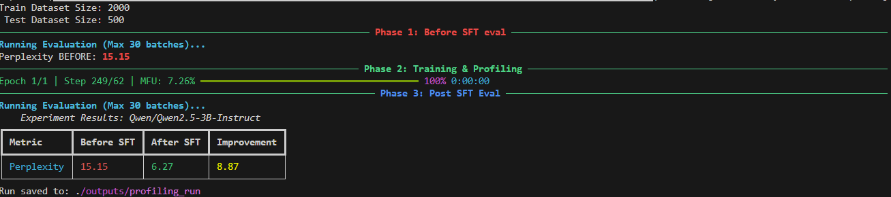
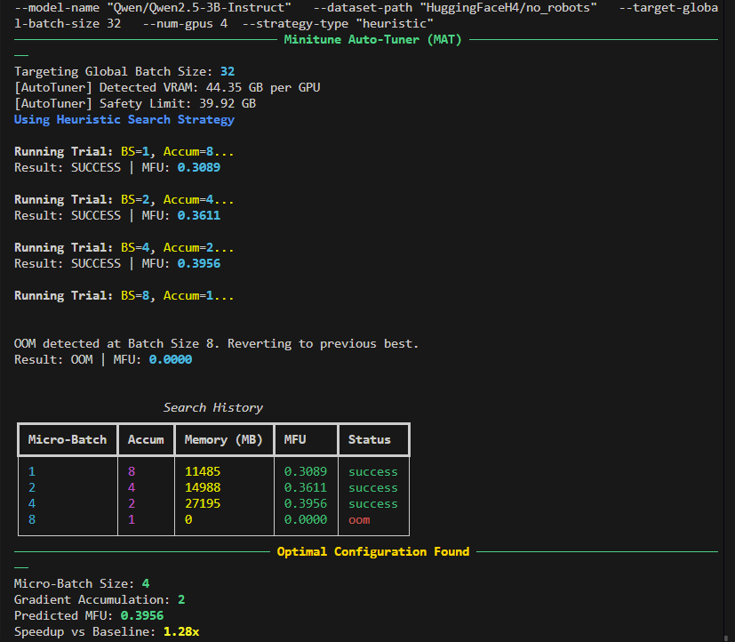

# minitune

`minitune` is a small, research-focused Python library for post-training Large Language Models. It provides a clean and transparent codebase for common alignment tasks like Supervised Fine-Tuning (SFT) and Reinforcement Learning (DPO, GRPO), built on top of the Hugging Face ecosystem.

Unlike high-level abstractions, `minitune` exposes the training loop, giving researchers direct control over distributed training details while automating the tedious parts—like finding the perfect batch size.

More than anything else, this library is my attempt to delve deeper into the knitty grity details of large scale model training, and share the same with the community.

### Core Goals

*   **Transparency over Abstraction:** Direct access to the PyTorch training loop, powered by `accelerate` for seamless distributed training (FSDP/DDP).
*   **Automated Optimization:** Includes an **Auto-Tuner** that profiles your hardware to find the optimal training configuration automatically.
*   **Lean on the Ecosystem:** Uses best-in-class libraries (`transformers`, `peft`, `vllm`, `bitsandbytes`) for what they do best.

### Current Features

*   **Supervised Fine-Tuning (SFT):** Efficient PEFT/LoRA training with support for custom loss functions (e.g., Focal Loss).
*   **Direct Preference Optimization (DPO):** Stable RLHF alternative with integrated reference model management.
*   **Minitune Auto-Tuner (MAT):** A Bayesian/Heuristic engine that maximizes Model Flops Utilization (MFU) by tuning memory parameters.

### Installation

The project uses `uv` for fast and reliable package management.

1.  **Clone the repository:**
    ```bash
    git clone https://github.com/pranoy-panda/minitune.git
    cd minitune
    ```

2.  **Create a virtual environment and install dependencies:**
    ```bash
    # Create the virtual environment
    uv venv

    # Activate it (on Linux/macOS)
    source .venv/bin/activate

    # set cuda paths
    export CUDA_HOME="<replace with whatever ur path is, eg. /usr/local/cuda-12.4.0>"
    export PATH="${CUDA_HOME}/bin:${PATH}"
    export LD_LIBRARY_PATH="${CUDA_HOME}/lib64:${LD_LIBRARY_PATH}"

    # Install the project in editable mode with all dependencies
    uv pip install -e ".[dev]" --no-build-isolation

    # -no-build-isolation is required as to build `flash-attn` as it requires torch, but uv by default builds in isolation. So, this flag forces uv to build without isolation.
    ```

### Quickstart: Supervised Fine-Tuning (SFT)

`minitune` allows for programmatic configuration or CLI-based execution. 

**Run the example script:**
The example script automatically downloads data, applies a chat template, and runs a training loop with before/after evaluation.

```bash
# Run on a single GPU
python examples/01_run_sft.py --model-name "Qwen/Qwen2.5-3B-Instruct" --dataset-name "HuggingFaceH4/no_robots"

# Run distributed (Multi-GPU)
accelerate launch examples/01_run_sft.py --model-name "Qwen/Qwen2.5-3B-Instruct" --output-dir "./gemma-sft"
```

### Quickstart: The Auto-Tuner

In case you don't guess your batch size, or other distributed training configurations, let `MAT` find the configuration that yields the highest MFU (Model Flops Utilization) without crashing.

(please note, currently we only have support to tune batch size and gradient accumulation steps - we will soon add others!)


```bash
# Run the tuner to find the best Micro-Batch / Gradient Accumulation ratio
python minitune/autotuner/engine.py \
    --model-name "Qwen/Qwen2.5-3B-Instruct" \
    --dataset-path "HuggingFaceH4/no_robots" \
    --target-global-batch-size 128 \
    -- num-gpus 4 \
    --strategy-type heuristic
```

### Experiment Results

#### 1. SFT Performance
We measure perplexity on hold-out validation sets to ensure the model learns the instruction format without forgetting general knowledge.



*Figure 1: Perplexity drop on the `no_robots` dataset after 1 epoch.*

#### 2. DPO Alignment
Using Direct Preference Optimization to align the model with human preferences.


*Figure 2: Increase in Preference Accuracy (Chosen > Rejected) on `UltraFeedback` benchmark on HF*

#### 3. Auto-Tuner Optimization
The Auto-Tuner systematically explores the configuration space to find the "Pareto Frontier" of memory vs. speed.



*Figure 3: MFU improvement compared to a conservative baseline configuration.*


### Project Structure

```
minitune/
├── .gitignore
├── docs/
├── configs
│   ├── accelerate_fsdp_a40.yaml
│   └── minitune_sft_config_example.yaml
├── examples
│   ├── 01_run_sft.py
│   ├── 02_run_dpo.py
│   ├── __init__.py
├── minitune
│   ├── autotuner
│   │   ├── engine.py
│   │   ├── __init__.py
│   │   ├── README.md
│   │   ├── strategies.py
│   │   └── trial.py
│   ├── config.py
│   ├── data.py
│   ├── inference.py
│   ├── __init__.py
│   ├── losses.py
│   ├── rl
│   │   ├── dpo.py
│   │   └── __init__.py
│   ├── sft.py
│   └── utils
│       └── profiling.py
├── LICENSE
└── pyproject.toml
```