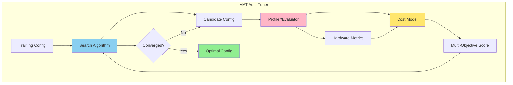

# Minitune Auto-Tuner (MAT)
**Automated Configuration Search for LLM Training**

## 1. Objective

To replace manual trial-and-error configuration with an automated system that **profiles hardware constraints** and discovers optimal training setups through systematic exploration.

**Core Goals:**
1. **Maximize MFU (Model Flops Utilization):** Achieve highest possible GPU compute efficiency
2. **Prevent OOMs:** Stay within memory limits with safety margins
3. **Minimize Trial Runs:** Find near-optimal configurations in 10-20 iterations


## 2. System Architecture



**Components:**
- **Search Algorithm**: Explores configuration space (binary search or Bayesian optimization)
- **Profiler/Evaluator**: Runs short training steps, measures memory and throughput
- **Cost Model**: Predicts memory usage and MFU for candidate configurations
- **Multi-Objective Scorer**: Balances performance vs. safety

---

## 3. Multi-Objective Optimization

### Formulation

We optimize a weighted combination of two competing objectives:

```
Score(config) = α × MFU(config) - β × MemoryPenalty(config)

where:
  MemoryPenalty = max(0, memory_used - 0.85 × gpu_capacity)²
```

### Motivation

**Why not just maximize MFU?**  
Aggressive configurations (large batch sizes, no activation checkpointing) maximize throughput but frequently cause OOMs, wasting time on failed runs.

**Why not just avoid OOMs?**  
Overly conservative settings (tiny batches, excessive checkpointing) are safe but leave 30-50% of compute capacity unused.

**The Trade-off:**  
The multi-objective formulation finds configurations on the Pareto frontier—high MFU while maintaining a safety margin (15%) below memory limits. The weights α and β can be tuned based on user priorities (speed vs. stability).

---

## 4. Search Space

We tune system parameters that directly impact memory and compute efficiency:

| Parameter | Range / Options | Impact |
|-----------|----------------|--------|
| **Micro-Batch Size** | `[1, 2, 4, 8, 16, ...]` | Primary driver of memory usage and compute intensity |
| **FSDP Sharding Strategy** | `FULL_SHARD`, `HYBRID_SHARD` | `FULL_SHARD` saves memory but needs high bandwidth; `HYBRID_SHARD` better for slow interconnects |
| **Activation Checkpointing** | `true` / `false` | Trades compute (recomputation) for VRAM |
| **Gradient Accumulation Steps** | `[1, 2, 4, 8, ...]` | Enables large effective batch sizes on memory-constrained GPUs |
| **Mixed Precision** | `bf16` (fixed for now) | Future: explore `fp16` / `fp8` on supported hardware |

**Constraints:**
- Effective batch size = `micro_batch_size × num_gpus × grad_accumulation_steps` (kept constant)
- `HYBRID_SHARD` only used for multi-node setups
- Parameters like `fsdp_backward_prefetch` and `fsdp_sync_module_states` remain fixed to avoid instability

---

## 5. Search Algorithms

### 5.1 Heuristic Binary Search (Baseline)

A simple, robust algorithm that converges in 8-12 iterations:

```
1. Start with conservative config:
   - micro_batch_size = 1
   - activation_checkpointing = true
   - FULL_SHARD

2. Profile current config → measure memory_used and MFU

3. Decision rules:
   IF memory_used < 0.70 × capacity AND MFU < target:
       → Double micro_batch_size
   ELIF memory_used > 0.85 × capacity:
       → Halve micro_batch_size OR enable checkpointing
   ELIF MFU < 0.80 × target AND checkpointing is ON:
       → Disable checkpointing (if memory allows)
   ELSE:
       → Converged

4. Repeat until convergence or max_iterations (default: 15)
```

**Pros:** Simple, interpretable, no external dependencies  
**Cons:** May miss non-obvious configurations (e.g., when toggling checkpointing + adjusting batch size simultaneously is optimal)

---

### 5.2 Bayesian Optimization (Advanced)

For sample-efficient search with complex interactions between parameters:

**Algorithm:** Gaussian Process Upper Confidence Bound (GP-UCB)

```
1. Initialization (3-5 random configs):
   - Sample diverse points from search space
   - Profile each → get (memory, MFU) observations

2. Fit Surrogate Model:
   - Train Gaussian Process: config → (memory, MFU)
   - Model captures uncertainty and correlations

3. Acquisition Function (UCB):
   score(config) = μ(config) + κ × σ(config)
   
   where:
     μ(config) = predicted multi-objective score
     σ(config) = prediction uncertainty
     κ = exploration parameter (default: 2.0)

4. Select next config to try:
   config_next = argmax(score) over valid search space

5. Profile config_next → update GP with new observation

6. Repeat steps 2-5 for 10-15 iterations
```

**Implementation:** Use `scikit-optimize` (skopt) with `gp_minimize`:
- **Kernel:** Matérn 5/2 (smooth but allows local variations)
- **Constraints:** Memory < 0.9 × capacity (enforced via penalty)
- **Warm start:** Transfer learned GPs across similar hardware

**Pros:** Finds global optimum faster, handles parameter interactions  
**Cons:** Requires scipy/sklearn, slightly more complex to implement

---

## 6. Expected Workflow

```
User: Provide model + dataset + target hardware
  ↓
MAT: Initialize with conservative config
  ↓
Search Algorithm: Propose candidate config
  ↓
Profiler: Run 50-100 training steps
  ↓
Cost Model: Estimate full-run memory and MFU
  ↓
Multi-Objective Score: Evaluate trade-off
  ↓
Search Algorithm: Update beliefs, propose next config
  ↓
[Repeat 10-20 times]
  ↓
Output: Optimal config + performance report
```